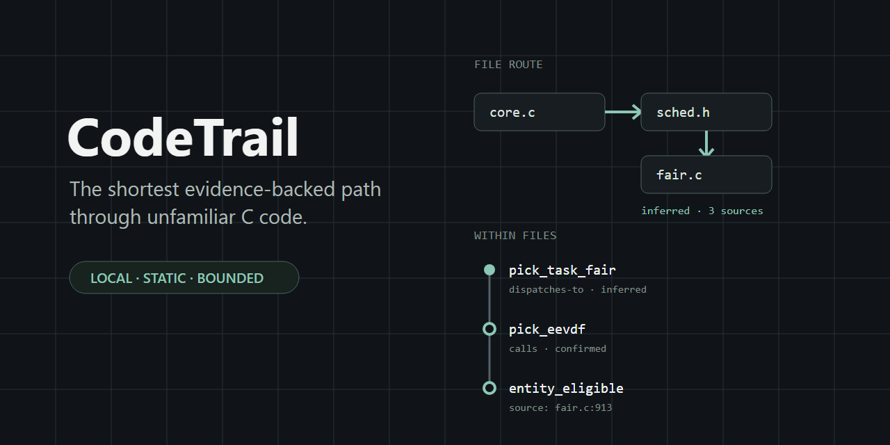
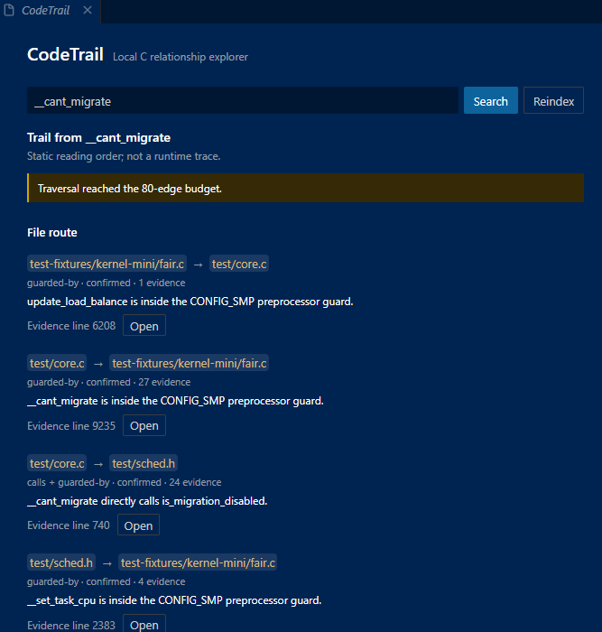

# CodeTrail

Find the shortest evidence-backed path through unfamiliar C code, without leaving VS Code.



Search is good at finding names. It is much less helpful when behavior crosses headers, designated initializers, function pointers, preprocessor guards, and direct calls. CodeTrail turns those links into a compact reading order: files first, functions inside each file second.

CodeTrail is local and deterministic. It does not call an AI service at runtime, upload source, or claim that a static path is a runtime trace.



This is an actual extension result for `__cant_migrate`. The panel keeps the file route, source reasons, confidence, evidence counts, and the traversal budget visible instead of hiding uncertainty behind a generated explanation.

## Contents

- [Install](#install)
- [Try it in 60 seconds](#try-it-in-60-seconds)
- [What CodeTrail finds](#what-codetrail-finds)
- [Proof on the Linux scheduler](#proof-on-the-linux-scheduler)
- [How it works](#how-it-works)
- [Confidence and evidence](#confidence-and-evidence)
- [Editor commands](#editor-commands)
- [For coding agents](#for-coding-agents)
- [Privacy and security](#privacy-and-security)
- [Known limits](#known-limits)
- [Built with Codex and GPT-5.6](#built-with-codex-and-gpt-56)
- [Development](#development)

## Install

CodeTrail requires VS Code 1.107 or newer.

Build and install the VSIX:

```powershell
npm ci
npm run package
code --install-extension .\codetrail.vsix --force
```

Reload VS Code after installation. To run from source instead, open this repository in VS Code and press `F5`.

## Try it in 60 seconds

1. Open a folder containing `.c` and `.h` files.
2. Run `CodeTrail: Index Workspace` from the Command Palette.
3. Run `CodeTrail: Search Code` and enter `schedule`.
4. Pick a ranked function. Match reasons explain why it appeared.
5. Read **File route**, then **Within files**.
6. Select `Open` on any step to jump to its source range.

The search field stays available while you inspect a trail, so a follow-up search does not reset the panel.

You can also start at a function definition:

- click `CodeTrail: discover links` above the function;
- place the cursor on a symbol and press `Alt+Shift+T`;
- right-click and choose `CodeTrail: Discover Symbol Links`.

All four entry points use the same index and bounded discovery logic.

## What CodeTrail finds

CodeTrail's first release targets GNU C, with special attention to systems code.

| Source pattern | Relationship shown |
|---|---|
| `next = pick_next_task(rq)` | confirmed direct call |
| `.pick_task = pick_task_fair` | inferred registration |
| `class->pick_task(rq)` | inferred function-pointer dispatch |
| `#ifdef CONFIG_SCHED_CLASS_EXT` | configuration guard |
| a link crossing `sched.h` and `fair.c` | cross-file route with evidence count |

This is more useful than a full call-graph canvas for the question CodeTrail answers: "What should I read, and why?"

## Proof on the Linux scheduler

The reproducible evaluation indexes 50 C/header files from `kernel/sched` at upstream Linux commit `7059bdf4f04a3e14f4fafb3ac35fdca913e3e21a`.

| Search | Required answer | Observed rank |
|---|---:|---:|
| `schedule` | `__schedule` | 1 |
| `eevdf eligible` | `entity_eligible` | 2 |
| `register dispatch` | `pick_task_fair` | 10 |

The index contains 3,743 nodes and 33,099 typed edges across 2,049,984 bytes of source. The selected `__schedule` path reaches 12 symbols across 17 file sections before its visible trail budget stops it.

The [machine-readable result](demo/linux-scheduler-evaluation.json) records every top-20 candidate, score reason, warning, bound, confidence label, and source range. See the [evaluation method and reproduction steps](demo/linux-scheduler-evaluation.md).

For the submission demo, open the checked-in three-file Linux scheduler snapshot:

```powershell
code .\test
```

It contains the upstream `core.c`, `fair.c`, and `sched.h` files from the same pinned commit: 30,959 lines and 848,962 bytes in total. The [independent recorder handoff](demo/independent-recorder-script.md) gives the exact installation steps, searches, symbols, source lines, narration, and recovery checks for the final recording.

For a shorter development fixture, open:

```powershell
code .\test-fixtures\kernel-mini
```

The fixture keeps the relationship chain short enough for automated tests. The files under [`test/`](test/README.md) are unmodified upstream Linux source and retain their GPL-2.0 licensing; they are not covered by CodeTrail's MIT license.

## How it works

```text
C and header files
  -> Tree-sitter C structural parser
  -> kernel-aware relationship enrichment
  -> typed immutable workspace index
  -> deterministic lexical and relationship ranking
  -> bounded evidence subgraph
  -> file route, then within-file symbol path
```

Analysis runs in a worker so parsing does not block the extension host. Snapshots are gzip-compressed, size-limited, and schema-validated before reuse. Search normalizes identifier forms and a small code vocabulary, supports one bounded typo, and caps results at 20. Broad single-token searches reserve space for useful structural neighbors instead of returning one file's lexical matches exclusively.

Read [the architecture](docs/architecture.md) for component boundaries and budgets.

## Confidence and evidence

Every relationship carries a source path, range, reason, and confidence:

| Label | Meaning |
|---|---|
| `confirmed` | The parser sees a direct structural fact, such as a function call. |
| `inferred` | Source syntax supports the link, but the link depends on a pattern such as registration or pointer dispatch. |
| `possible` | The evidence names plausible targets but cannot select one safely. |

Budget warnings remain visible. Every trail says `Static reading order; not a runtime trace.` CodeTrail would rather show an honest gap than turn an inference into a fact.

## Editor commands

| Command | Purpose |
|---|---|
| `CodeTrail: Index Workspace` | Build a fresh local index for the open folder. |
| `CodeTrail: Search Code` | Open the persistent search and discovery panel. |
| `CodeTrail: Discover Symbol Links` | Discover the symbol under the cursor. Also available from the context menu and `Alt+Shift+T`. |
| `CodeTrail: Discover Indexed Function` | Open an exact indexed function from CodeLens. |
| `CodeTrail: Open Evidence Source` | Open a validated source location from a result. |

`codetrail.filesMax` controls the maximum indexed C/header files. The default is 2,000 and the hard maximum is 10,000.

## For coding agents

MCP is an optional adapter, not a second product. It gives a coding agent the same ranked symbols and evidence paths that a developer sees in VS Code.

Build the local stdio server:

```powershell
npm ci
npm run build
node .\dist\mcp-server.cjs --workspace C:\absolute\path\to\c-workspace
```

Use the absolute paths from [demo/mcp-config.example.json](demo/mcp-config.example.json) in an MCP client. The server exposes three read-only tools:

| Tool | Use it for |
|---|---|
| `search_code` | Rank symbols for a keyword or identifier query. |
| `get_symbol` | Inspect direct source-backed relationships for one exact symbol ID. |
| `get_reading_path` | Retrieve the bounded file-first hierarchy for one exact symbol ID. |

There is also a `codetrail://workspace/status` resource. Responses are structured, capped at 256 KiB, and contain evidence rather than full source files.

On the pinned Linux scheduler tasks, two MCP calls retrieved the required answer and evidence while returning 97.33% to 99.34% fewer bytes than the indexed source. That is a context-volume result, not an LLM accuracy claim. The [method and raw result](demo/mcp-evaluation.md) spell out the boundary.

## Privacy and security

- Runtime analysis and snapshots stay local.
- There is no telemetry, account, hosted inference, or source upload.
- CodeTrail never builds or executes workspace code.
- Indexing skips symlinks and excluded build/dependency directories.
- File count, bytes, queue depth, graph traversal, snapshots, operations, and MCP responses have explicit limits.
- Source navigation rejects destinations outside the indexed workspace.
- Webview and worker messages are schema-validated; source-derived text is never inserted as HTML.

Read [PRIVACY.md](PRIVACY.md) and [SECURITY.md](SECURITY.md) for the complete boundaries. Support requests go through [SUPPORT.md](SUPPORT.md).

## Known limits

- The release supports C structure, not full C++ semantics.
- It does not preprocess every kernel configuration.
- Macro-heavy GNU C can produce recoverable partial-parse warnings.
- Function-pointer links may remain inferred or possible.
- Search is lexical and explainable; it does not answer arbitrary natural-language questions.
- Whole-kernel indexing is intentionally bounded. Open the subsystem you need.
- Reindex after source changes; incremental indexing is not in this release.
- CodeTrail recommends an outgoing static reading path. It is not a whole-program impact analyzer or runtime profiler.

## Built with Codex and GPT-5.6

GPT-5.6 was part of CodeTrail from the first product discussion through the final release. I used it to explore the idea, refine the product as it evolved, decide the architecture, and work through the tradeoffs behind the C-first scope and file-first interface.

Codex with GPT-5.6 was the build tool for the project. Every implementation step ran through Codex: repository exploration, test-first changes, code editing, debugging, terminal verification, VSIX packaging, installed-extension checks, Linux scheduler evaluation, MCP testing, documentation, and GitHub release work. I set the direction, made the product decisions, reviewed the results, and explicitly authorized the account and publishing actions.

Codex also handled the public release. With my authorization, it created the publisher account on my behalf and published CodeTrail 0.1.3 to both the [Visual Studio Marketplace](https://marketplace.visualstudio.com/items?itemName=crankysmh47.codetrail-c-evidence-paths) and [Open VSX](https://open-vsx.org/extension/crankysmh47/codetrail-c-evidence-paths). The accounts and extension identity remain under my ownership.

The repository keeps that work inspectable:

| Stage | Evidence |
|---|---|
| Product definition | The [product design](docs/superpowers/specs/2026-07-14-codetrail-product-design.md) records the problem, product boundary, and original architecture. |
| Technical decisions | The [C-first analysis decision](docs/decisions/0001-c-first-hybrid-analysis.md) and [static-trail trust boundary](docs/decisions/0002-static-trail-trust-boundary.md) explain why the release uses structural evidence and never calls a trail a runtime trace. |
| Implementation | The [Codex development record](docs/build-with-codex.md) maps tested work units to commits, including the parser, search, graph traversal, worker, VS Code experience, MCP adapter, and release engineering. |
| Verification | The release gate runs 128 tests, coverage, a production dependency audit, package inspection, spawned MCP protocol tests, and pinned Linux scheduler evaluations on Windows and Ubuntu. |
| Publication | Version 0.1.3 is available from the Visual Studio Marketplace and Open VSX under the same `crankysmh47.codetrail-c-evidence-paths` identity. |

CodeTrail itself does not contain GPT-5.6, Codex, or an OpenAI API. That boundary matters: Codex with GPT-5.6 built the tool, while the shipped extension stays local, deterministic, and usable without an account or network connection.

## Development

The project uses npm and Node.js 24.

```powershell
npm ci
npm run check
npm test
npm run test:coverage
npm audit --omit=dev --audit-level=high
npm run package
```

Useful evidence commands:

```powershell
npm run test:mcp:e2e
npm run evaluate:linux -- --workspace .cache/linux-scheduler
npm run evaluate:mcp -- --workspace .cache/linux-scheduler/kernel/sched --output demo/mcp-evaluation-results.json --profile linux-7059
```

The [development record](docs/build-with-codex.md) separates human direction from Codex execution and links the major claims to tests and commits.

## License

CodeTrail is MIT-licensed. See [LICENSE](LICENSE). The copied Linux scheduler sources under [`test/`](test/README.md) retain their upstream GPL-2.0 licensing and copyright notices.
