# CodeTrail architecture

## Runtime data flow

```mermaid
flowchart LR
    A["C workspace"] --> B["Bounded file indexer"]
    B --> C["Tree-sitter C adapter"]
    C --> D["Kernel scheduler enricher"]
    D --> E["Typed workspace index"]
    E --> F["Deterministic search"]
    F --> G["Bounded subgraph"]
    G --> H["Ordered trail"]
    H --> I["VS Code webview"]
    I --> J["Validated source navigation"]
```

The extension host owns commands, VS Code navigation, workspace storage, and the webview panel. Parsing and graph work run in `analysis-worker.cjs`. Every message crossing that boundary is schema-validated.

## Stable core contracts

`src/core/contracts.ts` defines language-neutral nodes, edges, search candidates, and trails. A language adapter must produce those contracts without leaking parser-specific objects into search or UI code.

Each edge carries:

- source and target node IDs;
- a typed relationship;
- source range and path;
- `confirmed`, `inferred`, or `possible` confidence;
- a human-readable reason.

## C adapter

The baseline parser is Tree-sitter C compiled to WebAssembly. WebAssembly avoids native addon installation and produces the same parser artifact on Windows and Linux. The adapter extracts the structural facts that are useful without a configured compiler.

The shipped grammar uses the Tree-sitter 0.20 ABI, so the runtime is pinned to `web-tree-sitter` 0.20.8. This is an intentional compatibility pin, covered by a real parser load test and a bundled-worker smoke test.

## Kernel scheduler enrichment

The kernel enricher handles patterns whose meaning is split across syntax:

- designated initializer registration such as `.pick_task = pick_next_task_fair`;
- calls through `struct sched_class` fields;
- scheduler definition macros;
- `CONFIG_*` guard ancestry.

It never upgrades pointer or macro evidence to `confirmed` without compiler proof.

## Search and trail selection

Search normalizes snake case, camel case, punctuation, stop words, and a small documented synonym set. Scores come from symbol tokens, signatures, paths, and summaries. Stable path/line/ID tie-breaking keeps results reproducible.

Subgraph construction uses explicit node, edge, depth, and wall-clock budgets. Trail selection follows typed outgoing evidence and stops at a 12-step readability limit. The result is a recommended reading sequence, not an execution trace.

## Persistence and trust boundaries

Snapshots are gzip-compressed JSON with schema validation and compressed/decompressed size limits. The indexer skips symlinks and common generated directories. Source navigation resolves only workspace-relative paths. The webview has a nonce CSP, no network permission, and no source-derived HTML injection.

## Optional Clang capability

The Build Week package reports whether `clang` is available by running `clang --version` with a three-second timeout. Compiler AST enrichment remains a post-hackathon adapter. Structural mode is complete without it.
