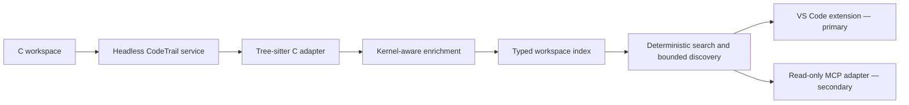

# CodeTrail winner release design

**Date:** 2026-07-15

**Status:** Approved for implementation
**Audience:** OpenAI Build Week Developer Tools judges, C systems developers, and coding-agent users

## Product thesis

CodeTrail turns unfamiliar C source into the smallest evidence-backed reading path.

The VS Code extension is the product. It gives a developer a fast, coherent workflow from a keyword or function definition to a cross-file route, an ordered within-file path, and the exact source evidence behind every relationship. The MCP server is a deliberately secondary distribution surface for the same deterministic analysis. It should make CodeTrail more useful to coding agents without changing the product into an AI wrapper or competing with the editor experience for attention.

The Build Week release must prove four things:

1. **Technological implementation:** one non-trivial, tested analysis engine powers an installed VS Code extension and a narrow MCP adapter.
2. **Design:** the extension remains minimal, legible, and runnable from install through source navigation; secondary surfaces inherit the same vocabulary and trust model.
3. **Potential impact:** developers and coding agents can inspect less source while finding the relevant symbol and evidence path more reliably.
4. **Quality of the idea:** CodeTrail understands why systems-code navigation is difficult: behavior crosses files, macros, registrations, function pointers, configuration guards, and indirect dispatch.

## Product hierarchy

### Primary: VS Code extension

The judge-facing story begins and ends in VS Code:

1. Index a local C workspace.
2. Search for a code term such as `schedule`, or invoke CodeTrail on a function definition.
3. Select a ranked symbol with an explainable score.
4. Read the cross-file route.
5. Follow the ordered symbols within each file.
6. Inspect confidence, relationship evidence, bounded-analysis warnings, and source locations.

The editor experience must stay keyword-first, compact, native-looking, and deterministic. The MCP must not add buttons, account flows, conversational UI, network services, or runtime model dependencies to this experience.

### Secondary: MCP adapter

The MCP server exists to demonstrate that CodeTrail is useful infrastructure beyond its UI. It exposes a small read-only interface over the same index, search, graph, and discovery functions. It does not generate prose, modify files, run code, invoke an LLM, or claim capabilities that the core engine does not possess.

The Marketplace README should describe MCP after the editor workflow and real Linux demonstration. The three-minute live demo may use one brief MCP call after the VS Code proof, or show its recorded evidence if time is tight.

## Architecture



The new headless service owns parser initialization, bounded workspace indexing, symbol lookup, search, and discovery. It contains no VS Code or MCP types. The existing worker and the MCP server both call core operations rather than reimplementing graph logic.

The MCP boundary performs only four jobs:

- validate tool arguments;
- call the headless service;
- project domain objects into bounded structured responses;
- translate failures into actionable tool errors without leaking stack traces.

The MCP server uses the stable `@modelcontextprotocol/sdk` 1.x package and local stdio transport. Standard output is reserved for protocol traffic; diagnostics go to standard error. There is no HTTP listener and no network call.

## MCP contract

Every successful tool response returns both `structuredContent` and an equivalent compact JSON text block for broad client compatibility. Responses include `analysisKind: "static-reading-path"` and `disclaimer: "Static reading order; not a runtime trace."` where a path or relationship is returned.

All tools are annotated read-only, non-destructive, and idempotent.

### `search_code`

Purpose: find the best indexed starting symbols for a keyword or identifier query.

Input:

```json
{
  "query": "schedule",
  "limit": 10
}
```

Rules:

- `query` is trimmed and limited to 200 characters;
- `limit` defaults to 10 and is bounded from 1 through 20;
- results preserve deterministic ranking and tie-breaking from the core search;
- each candidate includes stable symbol ID, kind, name, signature, source range, score, and human-readable ranking reasons;
- `truncated` states whether more candidates existed than the requested limit.

### `get_symbol`

Purpose: inspect one indexed symbol and its direct evidence-backed relationships.

Input:

```json
{
  "symbolId": "c:kernel/sched/fair.c:function:pick_next_task_fair"
}
```

Rules:

- `symbolId` is limited to 500 characters;
- the response contains the symbol and at most 40 incident relationships;
- every relationship includes direction, kind, confidence, reason, evidence path, and evidence range;
- unknown symbols produce a concise tool error and suggest `search_code`;
- relationships use stable ordering and report `truncated` when capped.

### `get_reading_path`

Purpose: return the same cross-file and within-file hierarchy shown in VS Code.

Input:

```json
{
  "symbolId": "c:kernel/sched/fair.c:function:pick_next_task_fair"
}
```

Rules:

- uses fixed product budgets: 40 nodes, 120 edges, depth 4, 1,000 milliseconds;
- includes the ordered trail, cross-file links, file sections, warnings, confidence, and evidence;
- does not expose user-controlled traversal maxima in the Build Week interface;
- reports partial and truncated results as useful data rather than hiding them;
- never calls the result an execution path or runtime trace.

### `codetrail://workspace/status`

Purpose: let hosts inspect index readiness and boundaries before calling a tool.

The resource returns:

- canonical workspace root;
- index creation time;
- files indexed;
- node and edge counts;
- warning count and warning summaries;
- partial-index state;
- supported language and structural-analysis mode;
- fixed traversal and indexing limits;
- the static-analysis disclaimer;
- the three available tool names.

It intentionally does not expose source contents, Git credentials, environment variables, repository remotes, or host information.

## Lifecycle and workspace safety

The CLI is launched as:

```text
node dist/mcp-server.cjs --workspace <absolute-or-relative-directory>
```

Startup resolves the requested directory to its canonical real path, verifies that it is a directory, initializes the bundled C parser, and builds one immutable index before accepting client requests. Startup failure exits non-zero with a concise diagnostic on standard error.

The indexer already skips symbolic links and common generated or dependency directories. It enforces file-count, per-file byte, total-byte, directory-count, parser-node, graph-size, depth, and time limits. The MCP adds input length and response-size caps. It never accepts an arbitrary file path, executes repository commands, loads project configuration, follows a symlink, or writes into the analyzed workspace.

Graceful `SIGINT` and `SIGTERM` handlers close the MCP server. In-process and spawned-client tests verify shutdown without orphaning a child process.

## Agent-value proof

The MCP claim must be specific and reproducible, not a generic statement that agents can use it.

The repository will include a deterministic evaluation harness with three scheduler tasks:

1. locate the main fair-scheduler selection entry point from `schedule`;
2. locate the EEVDF eligibility helper from `eevdf eligible`;
3. recover the registration and indirect dispatch relationship from `register dispatch`.

For each task the harness connects through MCP, calls the real tools, validates the expected symbol and relationship, and records:

- MCP round trips;
- structured response bytes;
- returned symbol and source-file counts;
- raw C/H workspace bytes;
- context reduction compared with giving an agent the complete scoped workspace;
- whether the expected answer and required evidence were present.

This is a retrieval-context benchmark, not a claim about model intelligence or universal task completion. It demonstrates the indirect success: CodeTrail gives an agent a small, structured, evidence-preserving context instead of requiring broad source ingestion. The report must state the fixture or Linux revision, machine-independent counts, timing caveats, and exact reproduction command.

## Real Linux proof

The two-file scheduler fixture remains the fast test and demo fallback. Winner credibility additionally requires a reproducible run against a pinned upstream Linux scheduler scope at commit `7059bdf4f04a3e14f4fafb3ac35fdca913e3e21a`.

The evidence artifact records:

- commit and exact included paths;
- environment and CodeTrail version;
- files and bytes indexed;
- node, edge, warning, and partial counts;
- index duration;
- the top results for all three judge searches;
- one complete `pick_next_task_fair` reading path;
- explicit limitations and any unresolved relationships.

The source itself is not vendored into the extension. A script consumes a user-supplied sparse checkout and emits deterministic JSON; the demo runbook contains the exact sparse-checkout commands. Recorded evidence is committed only after the script succeeds against the pinned revision.

## Marketplace experience

The Marketplace listing should look like a finished developer tool, not a hackathon artifact.

Required manifest and repository work:

- replace the placeholder publisher with the durable publisher ID selected by the human owner before public release;
- add `repository`, `homepage`, `bugs`, `author`, `keywords`, `galleryBanner`, `pricing`, and `preview` metadata;
- add a crisp PNG icon at 256 by 256 pixels;
- add a restrained hero image and two legible product screenshots hosted through the public repository or another HTTPS location before Marketplace publication;
- add `SUPPORT.md`, a privacy statement, a security-reporting route, and complete release notes;
- keep the repository README outcome-first, with install, 60-second workflow, Linux proof, trust model, MCP integration, development evidence, and honest limits;
- verify the packaged VSIX contains only runtime assets and intended documentation.

The repo can be pushed while private, but public visibility is the recommended release state because it improves trust and lets Marketplace rewrite relative image links correctly. Changing repository visibility and creating the Microsoft Marketplace publisher remain human credential actions.

## Demo narrative

The judge-facing demonstration is three minutes:

1. **Problem, 20 seconds:** unfamiliar kernel behavior crosses direct calls, registrations, function pointers, and files; plain text search produces fragments rather than a reading order.
2. **VS Code proof, 100 seconds:** index, search `schedule`, select `pick_next_task_fair`, show the file route, follow the within-file path, open evidence, and invoke the same hierarchy from CodeLens or the shortcut.
3. **Trust, 25 seconds:** point to relationship types, confidence, visible budgets, local-only behavior, and the runtime-trace disclaimer.
4. **Real scope, 20 seconds:** show the pinned Linux evaluation summary.
5. **Indirect agent value, 15 seconds:** show one MCP structured result and the context-reduction benchmark; immediately return to the product thesis.

The line to repeat is:

> CodeTrail turns unfamiliar C source into the smallest evidence-backed reading path—for developers in VS Code and, through MCP, for coding agents.

## Testing strategy

Implementation follows behavioral TDD. The release gate contains:

- unit tests for headless service construction, lookup, stable ordering, budgets, and errors;
- MCP handler tests for schemas, structured output, malformed input, unknown symbols, disclaimers, and truncation;
- in-process client/server initialization, tool listing, resource listing, resource read, and all tool calls;
- spawned stdio end-to-end testing of protocol cleanliness and graceful shutdown;
- workspace boundary tests for non-directories, symlinks, missing paths, excluded directories, and oversized input;
- deterministic repeated-output tests with volatile timestamps normalized;
- evaluation-harness tests for expected symbols, evidence, and honest metrics;
- existing extension unit, integration, gold, performance, installed-VSIX, package-content, coverage, and vulnerability gates.

CI runs the full suite on Windows and Ubuntu. The server bundle receives its own smoke test so local success cannot hide an import, path, or module-format failure.

## Error model

Expected tool mistakes return `isError: true` with a short correction-oriented message. Protocol argument validation is delegated to the SDK schema boundary. Unexpected internal errors are logged without stack data on standard output and returned as a generic tool failure.

Index warnings and traversal truncation remain part of successful structured data. A partial index is not an exception. A missing or invalid workspace is a startup failure because no trustworthy service can be offered.

## Explicit non-goals for Build Week

- no runtime OpenAI, Codex, embedding, or hosted model dependency;
- no conversational search UI;
- no code-writing, refactoring, shell, build, test, or mutation MCP tools;
- no prompts or server-initiated sampling;
- no remote HTTP MCP server, authentication service, or telemetry;
- no `trace_execution`, whole-program impact analysis, test discovery, data-flow, diff analysis, or call-frequency claim;
- no full C++ or multi-language claim;
- no whole-kernel completeness claim;
- no Marketplace automation that stores or requests the owner’s credentials.

These omissions protect the coherence of the product. The winning story is depth, trust, and evidence in one difficult workflow—not a long list of shallow agent tools.

## Success criteria

The release is ready only when:

- the installed VSIX retains the verified minimal editor workflow;
- the three Linux scheduler searches and function-definition entry points still pass;
- the MCP tools and status resource work through an actual spawned stdio client;
- every relationship-facing response preserves evidence, confidence, bounds, and the static-analysis disclaimer;
- the context benchmark is reproducible and accurately labeled;
- the pinned Linux evidence is generated by the committed harness;
- strict type checks, tests, coverage, build, audit, package, package-content inspection, and both CI operating systems pass;
- README, demo, Marketplace metadata, support, privacy, security, and limitations tell one precise product story;
- no unsupported runtime, language, or agent-performance claim appears in the product or submission materials.

## Protocol references

- [MCP TypeScript SDK](https://github.com/modelcontextprotocol/typescript-sdk)
- [MCP TypeScript SDK server guide](https://github.com/modelcontextprotocol/typescript-sdk/blob/main/docs/server.md)
- [VS Code extension publishing guide](https://code.visualstudio.com/api/working-with-extensions/publishing-extension)
- [VS Code extension manifest reference](https://code.visualstudio.com/api/references/extension-manifest)
